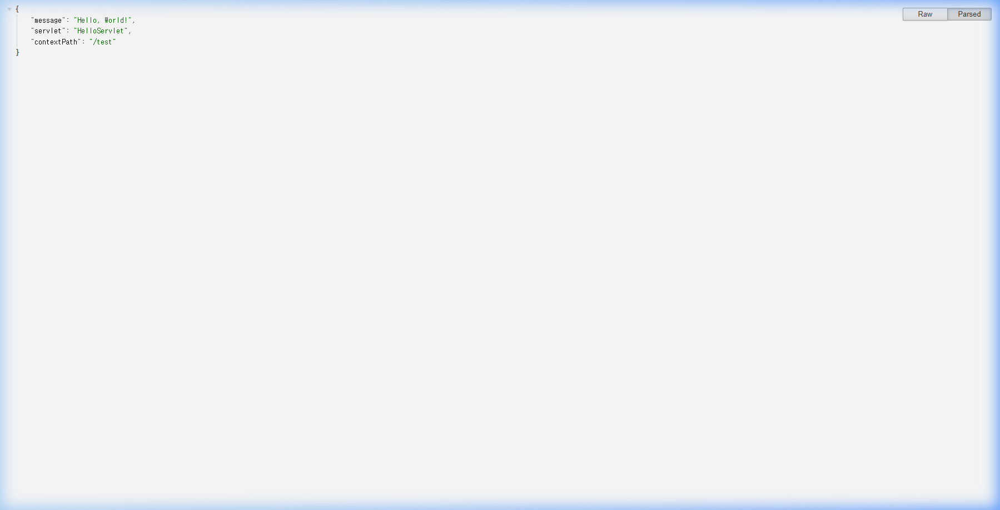
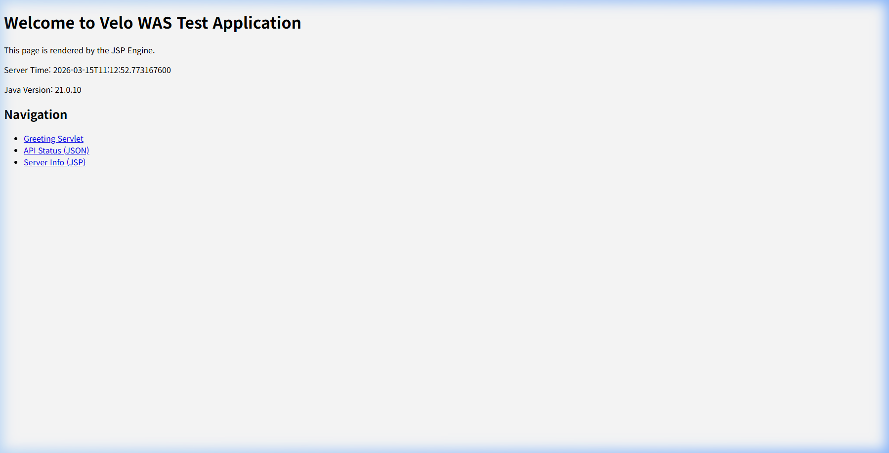
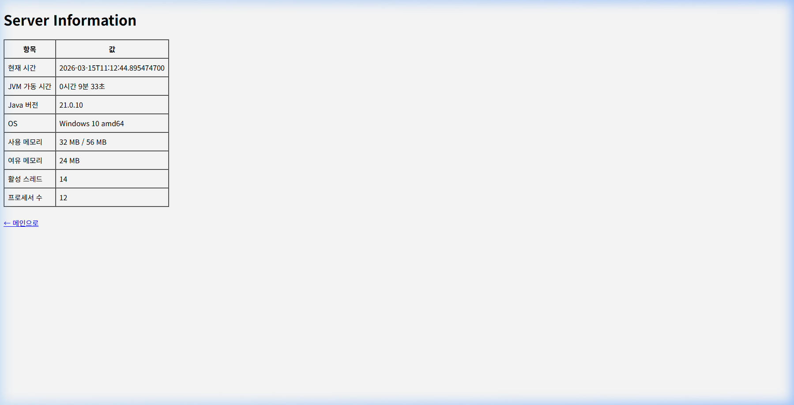
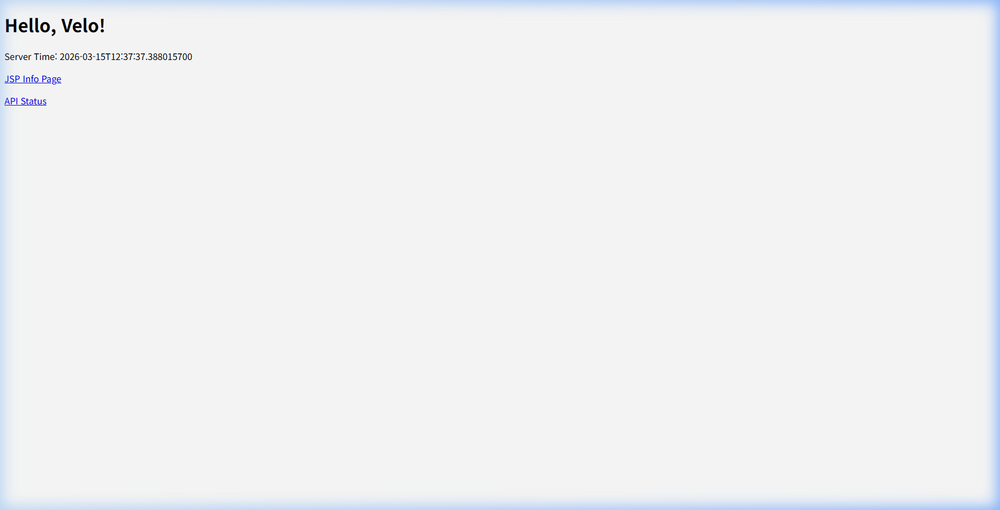
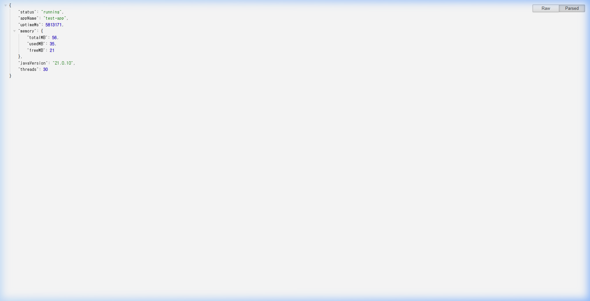

# WAR Deployment & JSP Testing Guide

This document guides you through deploying `test-war` and `test-app.war` in the Velo WAS project and verifying that the Servlet and JSP endpoints function correctly.

## System Requirements

- Java 21+
- Maven (for building)
- curl utility (for testing HTTP requests)

## 1. Preparation & Build

To test the deployment and Hot Deploy features, you must enable the feature in the server configuration file (`conf/server.yaml`).

Open `conf/server.yaml` and set `hotDeploy` to `true`:

```yaml
deploy:
  directory: deploy
  hotDeploy: true
  scanIntervalSeconds: 2
```

After modifying the configuration, build the entire Velo WAS platform.

```sh
# Build the Velo WAS platform
mvn clean package -DskipTests
```

## 2. Server Startup

Start the Velo WAS server in the background or in a new terminal window with the following command:

```sh
java -jar was-bootstrap/target/was-bootstrap-0.5.5-jar-with-dependencies.jar
```

When the `Hot deploy watcher started` message appears in the server startup logs, the server is successfully monitoring the `deploy` directory for automatic deployments.

---

## 3. Servlet Project Deployment Test (`test.war`)

The `test-war` module is a project intended to verify basic Servlet and Filter functionality.

### 3.1. Packaging & Deployment

Navigate to the `test-war` directory, package it, and copy it to the server's `deploy` directory.

```sh
# Build test-war
cd test-war
mvn clean package

# Copy the artifact to the Velo WAS deploy directory
cp target/test-war-0.5.5.war ../deploy/test.war
```

Since `hotDeploy` is enabled, a successful deployment message will appear in the server logs almost immediately (within ~2 seconds).

### 3.2. Endpoint Verification

Once deployed, verify the Servlet response using the `curl` command.

```sh
$ curl -s http://localhost:8080/test/hello

Hello from TestServlet! User-Agent: curl/8.x.x
```



If the response is properly printed out, it means the Servlet mappings in `test.war` are functioning properly.

---

## 4. JSP Project Deployment Test (`test-app`)

`test-app` is a project aimed at validating JSP file parsing, Java code generation (Translation), and the `JspServlet` mapping.

### 4.1. Project Structure

```text
test-app/
├── index.jsp         # Starting page
├── info.jsp          # System information page (contains <%@ page import="..." %>)
└── WEB-INF/
    └── web.xml       # Servlet & Deployment definitions
```

### 4.2. Packaging & Deployment

Navigate to the `test-app` directory and package the folder into a WAR format, then deploy it.

```sh
cd ../test-app

# Manually archive into a WAR file (using the jar command)
jar -cvf ../deploy/test-app.war *
```

Upon successful deployment, the following will appear in the loading logs:
> `INFO io.velo.was.deploy.WarDeployer - WAR deployed: name=test-app contextPath=/test-app source=deploy\test-app.war...`

### 4.3. JSP Endpoint Verification

If successfully deployed, check if the JSP files dynamically render HTML by requesting the following URLs.

```sh
# 1. Main Page Test
$ curl -s http://localhost:8080/test-app/index.jsp

<!DOCTYPE html>
<html>
<head>
    <title>Velo WAS - Test App</title>
</head>
<body>
    <h1>Welcome to Velo WAS Test Application</h1>
    <p>This page is rendered by the JSP Engine.</p>
...
</html>
```



```sh
# 2. Server Information Test (Referencing internal JVM objects)
$ curl -s http://localhost:8080/test-app/info.jsp

<!DOCTYPE html>
<html>
...
    <table border="1" cellpadding="8" cellspacing="0">
        <tr><th>Item</th><th>Value</th></tr>
        <tr><td>Current Time</td><td>2026-03-15T11:03:34.840</td></tr>
...
</html>
```



If you receive normal 200 HTTP response codes and the HTML body correctly displays without any `No servlet mapping` or `500 Server Error` errors, it signifies that JSP compilation, translation, and classloader integration have completely succeeded.

---

## 5. TCP Listener Test (Port 9090)

Velo WAS supports raw TCP listeners as well. We verify the echo functionality on port `9090` as defined in `conf/server.yaml`.

### 5.1. Test Python Script (`test_tcp_echo.py`)

The TCP listener uses `LENGTH_FIELD` framing (4-byte length header). Use the following script for validation:

```python
import socket
import struct

def test_echo(msg):
    s = socket.socket(socket.AF_INET, socket.SOCK_STREAM)
    s.connect(('127.0.0.1', 9090))
    
    # Send [4-byte length] + [payload]
    payload = msg.encode('utf-8')
    s.sendall(struct.pack('>I', len(payload)) + payload)
    
    # Receive response
    header = s.recv(4)
    resp_len = struct.unpack('>I', header)[0]
    data = s.recv(resp_len)
    print("Received: " + data.decode('utf-8'))
    s.close()

test_echo("Hello Velo TCP!")
```

### 5.2. Execution & Results

Run the script while the server is running to check the echo response.

```sh
$ python test_tcp_echo.py
Received: Hello Velo TCP!
```

If the received message matches the sent one, it confirms that the TCP layer's frame decoding and routing are working correctly.

### 4.4. Additional API Endpoints Verification

The `test-app` also includes standard Servlets in its `WEB-INF/classes` directory to verify mixed-mode (JSP + Servlet) routing capabilities.

```sh
# 1. Greeting Servlet Test
$ curl -s "http://localhost:8080/test-app/greeting?name=Velo"

<!DOCTYPE html>
<html><head><title>Greeting</title></head>
<body>
<h1>Hello, Velo!</h1>
...
</html>
```



```sh
# 2. Status API Test
$ curl -s http://localhost:8080/test-app/api/status

{
  "status": "running",
  "appName": "test-app",
  "uptimeMs": 5564648,
  "memory": { ... },
  "javaVersion": "21.0.10",
  "threads": 23
}
```


